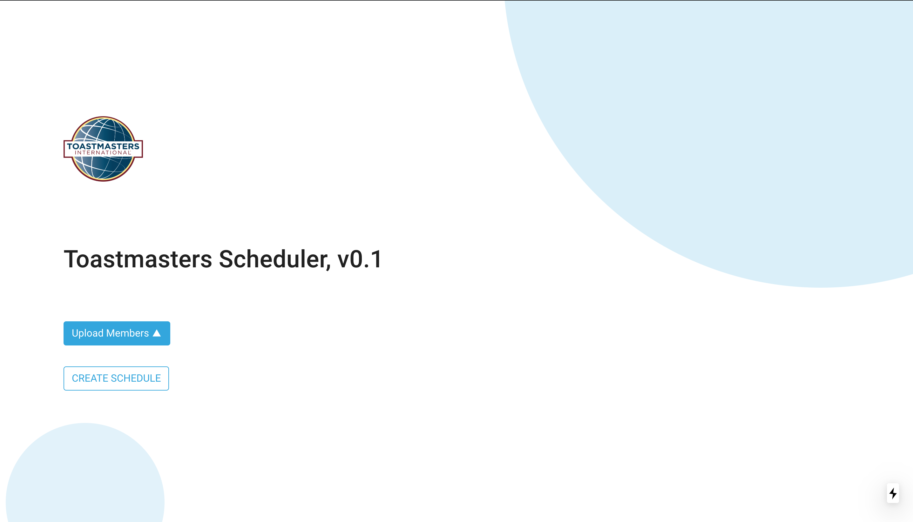
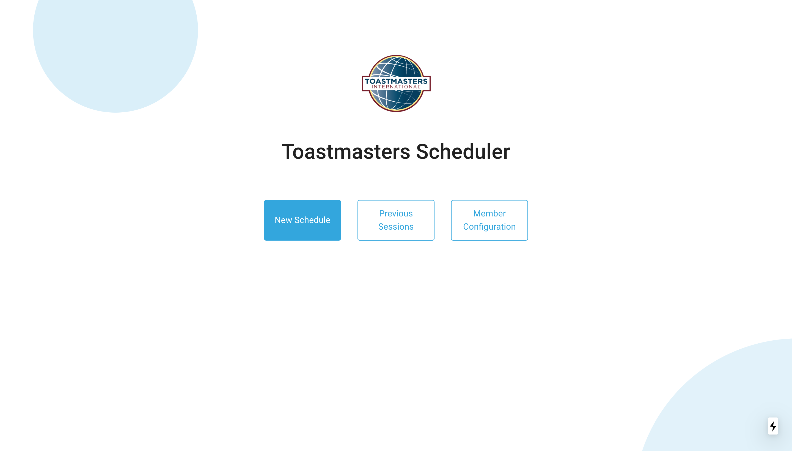
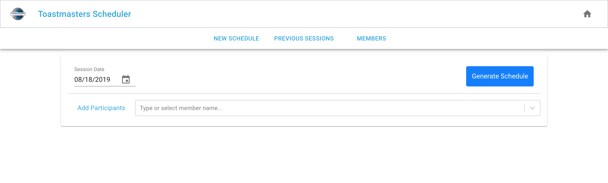
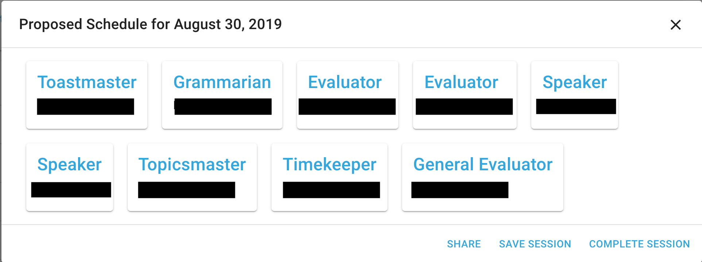
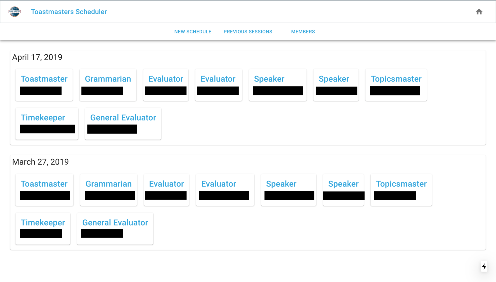

# scheduler-node

## Introduction
This project was built out of a need to randomly generate Toastmasters schedules. Based on a list of users and roles, the application will generate the optimal schedule via the [munkres](https://en.wikipedia.org/wiki/Hungarian_algorithm) algorithm. If the available users have not been assigned a particular role in the longest time of all available users, the algorithm will give greater precedence for that schedule assignment. However, the schedule will also keep in mind the capabilities of all users, as not all users can fulfill all assignments.

## How to use 

On startup, a landing page will determine if this is a new user or a returning one. If returning, upload the JSON database now.

After the initial page, the user can select one of four choices: **New Schedule**, **Previous Sessions**, **Member Configuration**, and **Role Configuration**.

The most important features are found on the **New Schedule** page. You can search from a list of your members to populate who has RSVP'd for the next Toastmasters session.

Once finished populating the available members, click on **Generate Schedule** to see the optimized schedule. At this point, the administrator can take several actions: **Share** the details via email; **Save** the temporary schedule to be loaded for later; or **Complete** the schedule and persist the arrangement into history. If none of these are preferable, the administrator can change around parameters to generate an entirely new schedule.

Another useful feature is the viewing of history. On the **Previous Sessions** tab, the administrator can see historical sessions persisted to the database.

## Features
- Strong security as no data is stored
- JSON data for persistence, easily manipulable
- Munkres' Hungarian Algorithm for optimized scheduling
- Lock ability to fix certain known assignments
- SSR from Next.js for speedy performance

## Technologies used
- React
- Next
- Node 

## TODO
- add / configure members + README
- add / configure roles + README
- add lock functionality to UI, be wary of export functionality and restore of session
- deploy